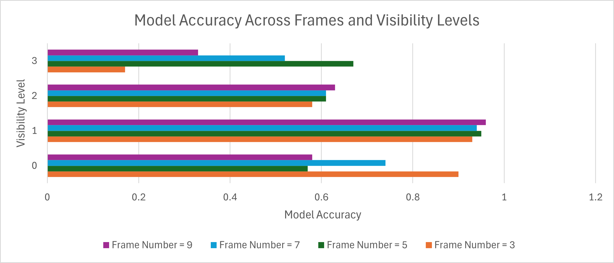
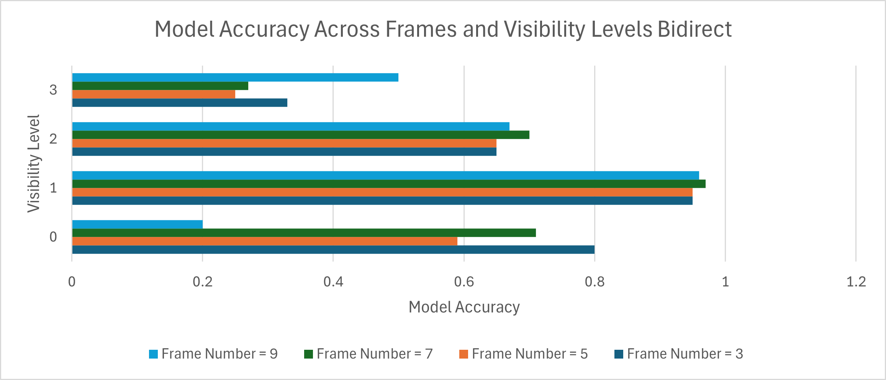

# TOTNet: Temporal and Spatial Network for Ball Tracking

TOTNet is specifically designed to utilize temporal and spatial information for ball tracking, especially in challenging occlusion scenarios.

---

## Environment Setup

### Recommended Environment

- **Python Version:** 3.10

### Installation Steps

1. Clone this repository and navigate to the project directory:
   ```bash
   git clone <repository-url>
   cd TOTNet
   ```

2. Install dependencies from the requirements file:
   ```bash
   pip install -r requirements.txt
   ```

3. Verify the installation:
   ```bash
   python --version  # Ensure it is Python 3.10
   ```

---

### Dataset Access

To facilitate reproducibility and further research, we provide links to access the datasets used in our study:

- **Tennis and Badminton Datasets**  
  Please follow the official instructions provided by the WASB-SBDT repository:  
  👉 [WASB-SBDT Dataset Instructions](https://github.com/nttcom/WASB-SBDT/blob/main/GET_STARTED.md)

- **TT Dataset (Table Tennis)**  
  The TT dataset can be obtained via the TTNet repository:  
  👉 [TTNet Dataset Preparation](https://github.com/maudzung/TTNet-Real-time-Analysis-System-for-Table-Tennis-Pytorch/tree/master/prepare_dataset)

- **TTA Dataset (Table Tennis Australia)**  
  The TTA dataset is available upon request for research purposes only.  
  To access the dataset:
  1. Email us directly.
  2. You will receive a usage agreement form.
  3. Once the form is signed and returned, we will grant access to the dataset.

Please note that the TTA dataset must **not be redistributed** and is strictly intended for non-commercial, academic research use.


#### Dataset Organization

After downloading, organize your datasets as follows:
```
data/
├── tta_dataset/
├── tennis_data/
├── badminton_data/
```

---

## How to Run

### Training Command

Use the following command to train the model:
```bash
torchrun --nproc_per_node=3 main.py \
    --num_epochs 30 \
    --saved_fn 'TOTNet' \
    --num_frames 5 \
    --optimizer_type adamw \
    --lr 5e-4 \
    --loss_function WBCE \
    --weight_decay 5e-5 \
    --img_size 288 512 \
    --batch_size 24 \
    --print_freq 100 \
    --dist_url 'env://' \
    --dist_backend 'nccl' \
    --multiprocessing_distributed \
    --distributed \
    --dataset_choice 'tta' \
    --weighting_list 1 2 2 3 \
    --model_choice 'motion_light' \
    --occluded_prob 0.1 \
    --ball_size 4 \
    --val-size 0.2 \
    --no_test
```

### Explanation of Arguments

- `--nproc_per_node=3`: Specifies the number of GPUs to use.
- `--num_epochs`: Number of training epochs.
- `--saved_fn`: Name of the folder to save results.
- `--num_frames`: Number of consecutive frames to process.
- `--optimizer_type`: Optimizer choice (e.g., `adamw`).
- `--lr`: Learning rate.
- `--loss_function`: Loss function (e.g., `WBCE` for weighted binary cross-entropy).
- `--img_size`: Resolution of input images (height x width).
- `--batch_size`: Batch size for training.
- `--dist_url` and `--dist_backend`: Used for distributed training setup with `torchrun`.
- `--dataset_choice`: Dataset to use (`tta`, `tennis`, or `badminton`).
- `--model_choice`: Specify the model to use. Options include: `TOTNet`, `WASB`, `TrackNetV2`, and `monoTrack`.
- `--occluded_prob`: Probability of occlusion during training.
- `--val-size`: Validation dataset size as a fraction of the training dataset.
- `--no_test`: Disable testing after training.

---

## Notes for Debugging

1. **Distributed Training:**
   - Ensure `--nproc_per_node` matches the number of GPUs available.
   - If debugging or testing on a single GPU, set `--nproc_per_node=1` and remove `--multiprocessing_distributed` and `--distributed`.

2. **Dataset Preparation:**
   - Verify the dataset paths are correct.
   - Organize the datasets as described in the `Dataset Organization` section.

3. **Logs and Checkpoints:**
   - Checkpoint files and logs will be saved in the directory specified by `--saved_fn`.
   
---

## Example Dataset Structure

```
data/
├── tta_dataset/
│   ├── training/
│   │   ├── images/
│   │   ├── labels.csv
│   ├── test/
│   │   ├── images/
│   │   ├── labels.csv
├── tennis_data/
├── badminton_data/
```

---

## Example for Single GPU Debugging

To debug or run on a single GPU, use the following modified command:
```bash
python main.py \
    --num_epochs 10 \
    --saved_fn 'debug_run' \
    --num_frames 5 \
    --optimizer_type adamw \
    --lr 5e-4 \
    --loss_function WBCE \
    --weight_decay 5e-5 \
    --img_size 288 512 \
    --batch_size 16 \
    --dataset_choice 'tta' \
    --model_choice 'TOTNet' \
    --val-size 0.2
```
This will run on a single GPU without distributed training.

---

For further details or troubleshooting, refer to the documentation or open an issue in the repository. Happy Training!


## Implementation Details

### Framework
- **PyTorch**

### Hardware Specifications
- 2 × NVIDIA **A100** GPUs

### Training Hyperparameters

| Parameter         | Setting     |
|------------------|-------------|
| Learning Rate     | `5e-4`      |
| Weight Decay      | `5e-5`      |
| Batch Size        | `16`        |
| Epochs            | `30`        |
| Visibility Weights| `[1, 2, 2, 3]` |

All models were trained using the [AdamW optimizer](https://arxiv.org/abs/1711.05101), and these hyperparameters were consistent across datasets unless otherwise specified.

## Other Models

In our study, we re-implemented several ball tracking models.

- [TrackNetV2](https://ieeexplore.ieee.org/document/9302757) ([Sun et al., 2020](#)): re-implemented from scratch.
- [monoTrack](https://github.com/jhwang7628/monotrack) ([Liu et al., 2022](#)): re-implemented from scratch.
- [TTNet](https://ieeexplore.ieee.org/document/9150877) ([Voeikov et al., 2020](#)): re-implemented from scratch.

We directly used the [WASB model](https://github.com/nttcom/WASB-SBDT) by [Tarashima et al., 2023](#) via their official GitHub repository, which provided a strong benchmark due to its recent state-of-the-art performance.

### Note on TTNet Evaluation

TTNet is originally designed for a specific resolution of **128×320 pixels**, as used in its paper. Modifying its architecture to accommodate our input resolution of **288×512 pixels** would require significant changes and could affect its performance. To ensure a **fair comparison**, we evaluated TTNet across all datasets using its native resolution and settings.


## Ablation Study

We evaluated the impact of varying the number of input frames on model performance. Interestingly, increasing the number of frames beyond 5 did not improve accuracy. This is likely due to the frequent trajectory changes in racket sports—caused by rapid direction shifts when the ball is hit—making longer temporal windows less useful.


*Figure: Model accuracy across different numbers of input frames (3, 5, 7, 9) for each visibility level.*

We also compared using the **middle frame** versus the **last frame** as the prediction target. As shown below, performance remained consistent across both configurations. This suggests that **TOTNet effectively predicts ball trajectories using only past frames**, without requiring symmetric or future context.


*Figure: Model accuracy using the middle frame as target across varying input frame counts and visibility levels.*
